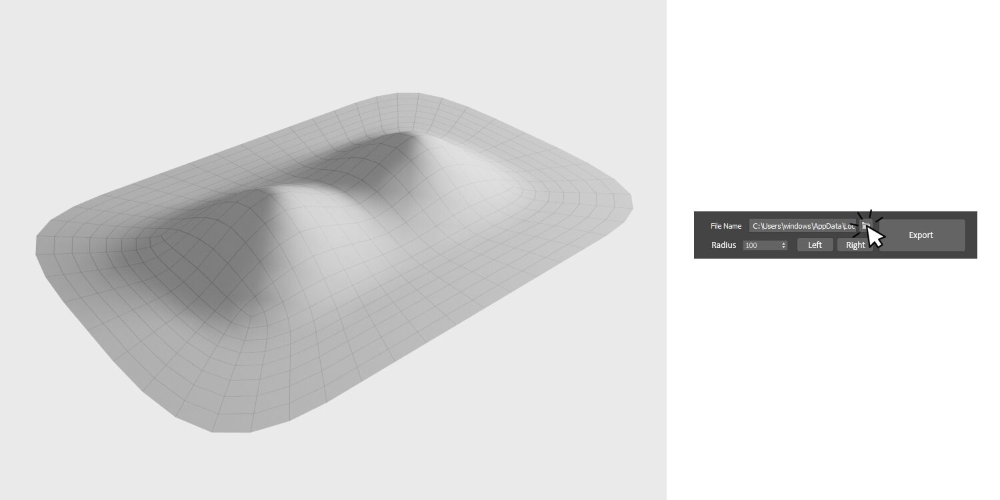
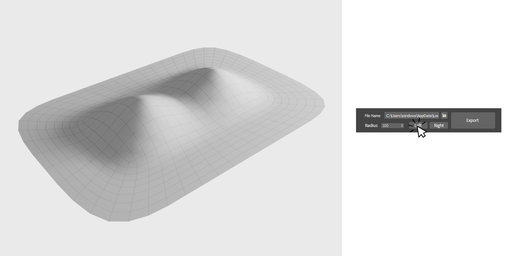
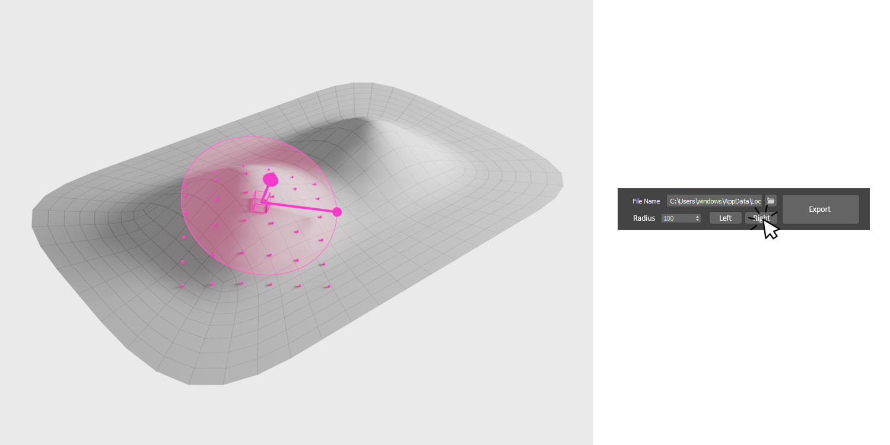
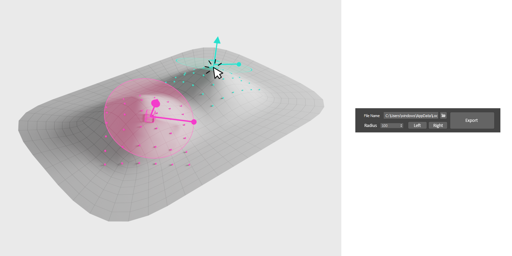
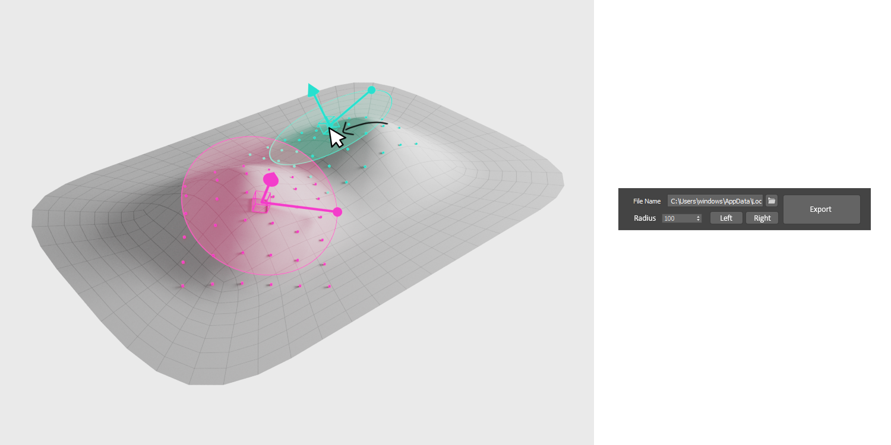
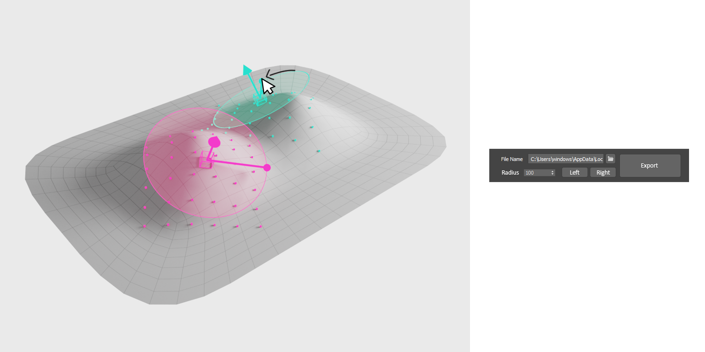

# Max Script Requirements

## ​​Short Pitch:

​​ Write a max script that takes a list of positions in 2d, a target object and a starting position selection by the user as inputs to generate a list of positions in 3d based on a deformation of the 2d positions over the object.

​​  

## ​​Details:

​​The objective of the script would be to take an array of pre-defined positions in 2d space (around 100 dots in a grid-like configuration) and project them over a 3d body to generate a new set of positions in 3d.

​​The process would work similarly to a "project" modifier, but dynamic and interactive. 

​​  

​​In order for the script to place the array properly, it needs some inputs from the user.

​​  

## ​​Components:

1. ​​The source file for the 2d array (a CSV file with a Point ID and an X and Y position value)

​​  

3. ​​A selected position placed over the surface. A null object can mark the spot. This selected position corresponds to the midpoint of both the 2d and 3d arrays. This point is also oriented along the normal of the surface.

4. ​​A radius setting. Essentially configuring the distance between the center and the border of the 2d array.

5. ​​An orientation setting to define the array rotation.

​​  

​​The final "projected" positions should be visible in the view-port and interactive in real time. They can be displayed as null objects for example.

​​The script also needs to handle two arrays simultaneously.

## ​​Proposed user interface:

​​The user selects a file that contains the 2d array positions

​​The user clicks a button on the script to activate the desired array to be placed. (left or right)

​​The user clicks on the target object. A single click selects the object and sets the center point in the click location.

​​A null object appears over the surface, alongside with a circle representing the radius parameter and a handle that controls the orientation. An array of nulls are also placed over the surface at the correct projected positions.

​​The user can grab the center null tu adjust the position, and the points move in real time.

​​The user can grab the handle to rotate the array, and the nulls move in real time.

​​After the user is done adjusting, they can select the other array and repeat the process.

​​The script features a radius parameter that affects both arrays simultaniously.

​​After both arrays are placed, the user can click on the export button to export a list of 3d position.

​​The output should be a CSV file saved in the same folder as the source array. The name of the file should be the name of the object. 

[1]: /ep/redirect/image?url=https%3A%2F%2Fpaper-attachments.dropbox.com%2Fs_79CE7879B6B45B81E2CE9F5E700FEB5A222E5A64FBE0C8A2E741EB88D509825B_1557279285664_1.png&hmac=kwvN%2Fa68lh8nhnVjz%2BZh%2BnC5nfobKAANLXVcTGJcpVo%3D
[2]: /ep/redirect/image?url=https%3A%2F%2Fpaper-attachments.dropbox.com%2Fs_79CE7879B6B45B81E2CE9F5E700FEB5A222E5A64FBE0C8A2E741EB88D509825B_1557279301533_0.jpg&hmac=HlXuGRe7p5kfXnYz7dla2TJTaOv0w%2FZEd0c0tgvBOTM%3D
[3]: /ep/redirect/image?url=https%3A%2F%2Fpaper-attachments.dropbox.com%2Fs_79CE7879B6B45B81E2CE9F5E700FEB5A222E5A64FBE0C8A2E741EB88D509825B_1557279309280_2.png&hmac=qXSXoUi%2B6DDHij6k1DlkM1kUBn3Q1ssuvJ4wak0BwUA%3D
[4]: /ep/redirect/image?url=https%3A%2F%2Fpaper-attachments.dropbox.com%2Fs_79CE7879B6B45B81E2CE9F5E700FEB5A222E5A64FBE0C8A2E741EB88D509825B_1557279314844_3.png&hmac=uNzvNiwqAR7rMHhYFDpbIk%2Bw4ggZ%2FyGkTUCIoKHaAaI%3D
[5]: /ep/redirect/image?url=https%3A%2F%2Fpaper-attachments.dropbox.com%2Fs_79CE7879B6B45B81E2CE9F5E700FEB5A222E5A64FBE0C8A2E741EB88D509825B_1557279332671_4.png&hmac=s%2F7qjaQPQzcpDYTRFXz4%2FxyIpmm23mOTS0kqTJ1baW4%3D
[6]: /ep/redirect/image?url=https%3A%2F%2Fpaper-attachments.dropbox.com%2Fs_79CE7879B6B45B81E2CE9F5E700FEB5A222E5A64FBE0C8A2E741EB88D509825B_1557279339494_5.png&hmac=7RvM59kDNF2g1yZOKMeEhb%2B3STNB2XP%2BxJaUfDGxYDU%3D
[7]: /ep/redirect/image?url=https%3A%2F%2Fpaper-attachments.dropbox.com%2Fs_79CE7879B6B45B81E2CE9F5E700FEB5A222E5A64FBE0C8A2E741EB88D509825B_1557279351098_6.png&hmac=YnDRh9i6fCn60So4t3c0ATsQB5GnEYfRxg%2FBo4S3LyM%3D
[8]: /ep/redirect/image?url=https%3A%2F%2Fpaper-attachments.dropbox.com%2Fs_79CE7879B6B45B81E2CE9F5E700FEB5A222E5A64FBE0C8A2E741EB88D509825B_1557279365028_7.png&hmac=ScOsQ9TT%2FM0m8%2FzkHMqHsIf30FfnF4qPuU43fF7xc70%3D
[9]: /ep/redirect/image?url=https%3A%2F%2Fpaper-attachments.dropbox.com%2Fs_79CE7879B6B45B81E2CE9F5E700FEB5A222E5A64FBE0C8A2E741EB88D509825B_1557279368371_8.png&hmac=Vp%2BsGc4xN9s0t9Jlzjhg9CUIBUBya3UmIPQMZkByL90%3D
[10]: /ep/redirect/image?url=https%3A%2F%2Fpaper-attachments.dropbox.com%2Fs_79CE7879B6B45B81E2CE9F5E700FEB5A222E5A64FBE0C8A2E741EB88D509825B_1557279371446_9.png&hmac=idbBczbdMTwYyrPevD7Fvs31SBB7doe1iyb6Y0Yx2UI%3D
[11]: /ep/redirect/image?url=https%3A%2F%2Fpaper-attachments.dropbox.com%2Fs_79CE7879B6B45B81E2CE9F5E700FEB5A222E5A64FBE0C8A2E741EB88D509825B_1557279379069_10.png&hmac=W0%2F6uY5Ph4DHswMCUdGIzPEAMpucNK%2BVfiELwQz%2F3Vc%3D
[12]: /ep/redirect/image?url=https%3A%2F%2Fpaper-attachments.dropbox.com%2Fs_79CE7879B6B45B81E2CE9F5E700FEB5A222E5A64FBE0C8A2E741EB88D509825B_1557279384771_11.png&hmac=s97ZpLEoQbV4zkhR4TWSLIy4brWnB4mEH76XUO8KEws%3D
